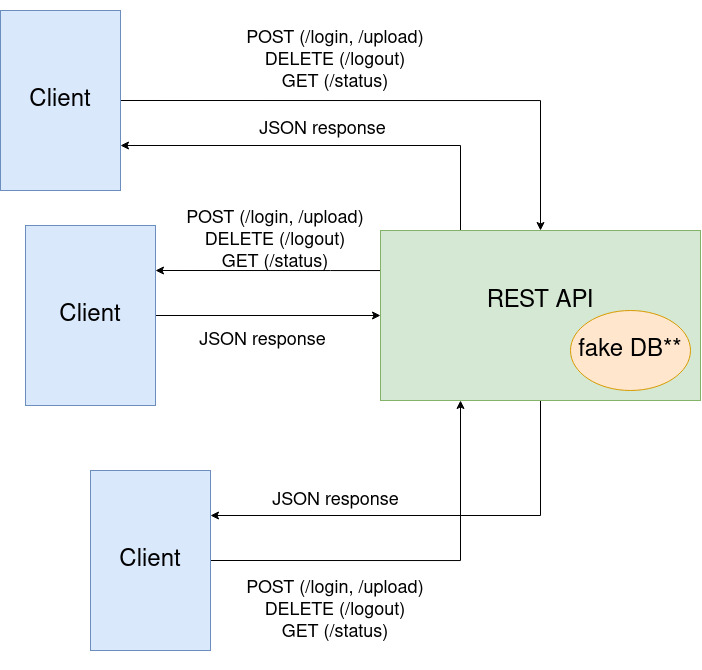

# Architecture Document

**\*\*fake DB**: Since all the testing and work in the application will be

at runtime, there is no need to use a proper DB. We store the users and images
inside de API server itself (making it not quite a RESTFUL api).

Either way if it were to be a separared DB, there would be an arrow going
from the REST API to the DB, and backwards. This arrow would represent, the
REST API reading information (users and images)from the DB, and the DB
responding.
